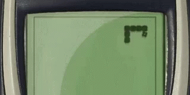

# :snake: Snake game :snake:

## Step 1. Display the board and a still snake
### 1-1. Use a `<canvas>` element to draw graphics with JavaScript.
the `<canvas>` element is initialized to a 400 x 400 white rectangle
### 1-2. Make the canvas
    ```
    const snakeboard = document.getElementById("gameCanvas");
    const snakeboard_ctx = gameCanvas.getContext("2d");
    ```
### 1-3. Make the static snake
 - Specify the initial location of our snake on the canvas by representing the snake as an array of coordinates.
 - To create a horizontal snake in the middle of the canvas, at (200, 200), we list the co-ordinate of each body part of the snake.
    ```
    let snake = [  {x: 200, y: 200},  {x: 190, y: 200},  {x: 180, y: 200},  {x: 170, y: 200},  {x: 160, y: 200},];
    // The very first coordinate represents the snake’s head.
    ```
    
- To display the snake on the canvas, we can write a function to draw a rectangle for each pair of coordinates.

## Step 2. Make the snake move automatically
### 2-1. declare a function to make snake move horizontally 
    ```
    function move_snake() {
      const newHead = { x: snake[0].x + dx, y: snake[0].y };
      snake.unshift(newHead);
      snake.pop()
    }
    ```
### 2-2. Declare a function to make snake move vertically
    ```
    const newHead = { x: snake[0].x + dx, y: snake[0].y + dy };
    ```
### 2-3. Automatic movement
- Create one function `main`, and call it over and over again.
- inside `main`, use `setTimeout` to add a slight delay between each movement.
- Don't forget to call `drawSnake` each time after move_snake.
Up until now, the snake starts to move if we set dx to 10 and dy to 0. But it would move out of the canvas instead of turning. We need to figure out how to control directions!

## 3. Using arrow keys to change the snake’s direction


CSS Tricks
1. To center an element in a its parent element using position absolute
```
#targetElement {
  position: absolute;
  top: 50%;
  left: 50%;
  transform: translate(-50%, -50%); 
}
```